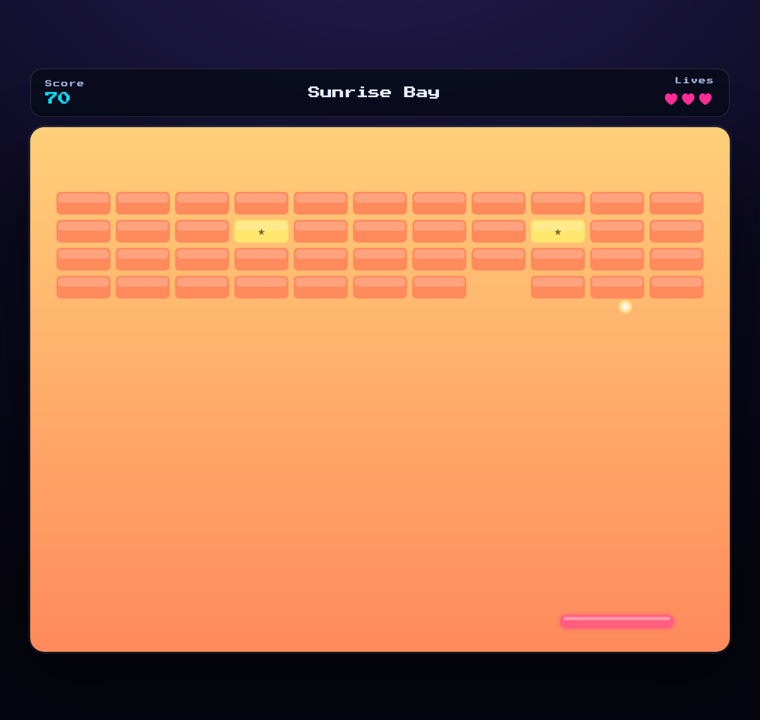

# Paddix 🧱🕹️

> A retro **brick-breaker** rebuilt in the browser — 8 themed stages, power-ups, combos, and an arcade-style high-score leaderboard.

[](https://danmat.github.io/Paddix/)
&nbsp;


<p align="center">
  
</p>

## Features

- 🎮 **Canvas game engine** — smooth 60fps, no jQuery, no dependencies.
- 🗺️ **8 themed stages** — Sunrise Bay, Neon City, Deep Sea, Jungle Ruins, Volcano Core, Ice Cavern, Space Station and Final Circuit, each with its own palette and difficulty.
- 🧱 **Brick variety** — 1/2/3-hit bricks, unbreakable blocks, and ★ power-up bricks.
- ⚡ **Power-ups** — <kbd>W</kbd> wide paddle, <kbd>M</kbd> multiball, <kbd>S</kbd> slow-mo, <kbd>+</kbd> extra life.
- 🔥 **Combos** — chain brick hits without touching the paddle for bonus points.
- 🏆 **Retro high scores** — enter your 3-letter initials and land on the leaderboard.
- 🕹️ **Play anywhere** — mouse, arrow keys, or touch-drag; fully responsive.

## Controls

| Action | Input |
| --- | --- |
| Move paddle | Mouse · Arrow keys · Touch drag |
| Launch ball | Click · <kbd>Space</kbd> |
| Pause | <kbd>P</kbd> or <kbd>Esc</kbd> |

## High scores & the shared leaderboard

Out of the box the leaderboard uses your browser's **localStorage**, so the game
is fully playable with zero setup. To share scores across devices — and across
all of Dan's games — point it at a free **Supabase** project:

1. Create a free project at [supabase.com](https://supabase.com).
2. In the **SQL editor**, run [`docs/supabase.sql`](docs/supabase.sql). It creates
   one `scores` table (namespaced by a `game` column) that every game can share,
   with row-level-security policies for safe public read/insert.
3. In **Project settings → API**, copy your **Project URL** and the public
   **anon key**.
4. Paste them into [`js/config.js`](js/config.js):
   ```js
   window.PADDIX_CONFIG = {
     supabaseUrl: 'https://YOUR-PROJECT.supabase.co',
     supabaseAnonKey: 'YOUR-ANON-KEY',
     gameId: 'paddix',
     leaderboardSize: 10
   };
   ```

The anon key is designed to be public; the database is protected by the RLS
policies in the SQL file. The leaderboard code (`js/leaderboard.js`) is written
to be reused by other games — just change `gameId`.

> Note: any client-side leaderboard can be spoofed by a determined user. The
> validation constraints stop casual tampering, which is plenty for an arcade board.

## Play locally

It's a static site — no build step:

```bash
git clone https://github.com/DanMat/Paddix.git
cd Paddix
python3 -m http.server 8000   # then visit http://localhost:8000
```

## How it works

| File | Responsibility |
| --- | --- |
| `js/game.js` | Canvas engine: render loop, paddle/ball/brick physics, power-ups, state machine. |
| `js/stages.js` | Pure-data stage definitions (add a stage = add an object). |
| `js/leaderboard.js` | Reusable high-score store: Supabase REST with a localStorage fallback. |
| `js/config.js` | Supabase URL/key and game id. |

## Credits

Rebuilt in vanilla JavaScript from the original 2011 jQuery version.

## License

[MIT](LICENSE) © DanMat
